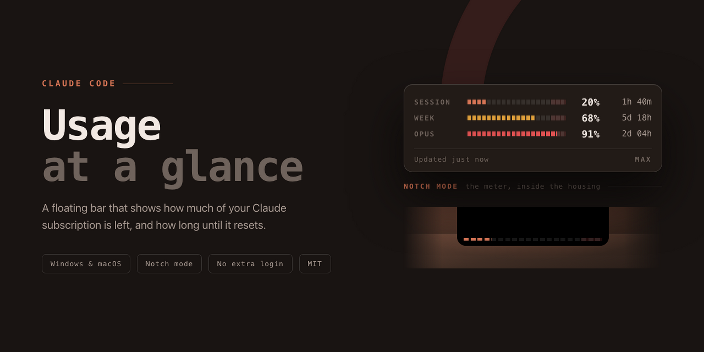

<div align="center">



**A floating bar that shows how much of your Claude Code subscription is left, and how long until it resets.**

[](#macos)
[](LICENSE)

</div>

---

Claude Code tells you your usage when you ask it. This keeps the answer on screen:
the 5-hour session window, the weekly window, and a live countdown to each reset —
in a small bar you park wherever you like and stop thinking about.

## Install

Both platforms are built on the [Releases page](../../releases):

| Platform                | Download                            |                                        |
| ----------------------- | ----------------------------------- | -------------------------------------- |
| Windows 10 / 11         | `Claude-Usage-Setup-<version>.exe`  | Click-through installer                |
| macOS — Apple silicon   | `Claude-Usage-<version>-arm64.dmg`  | One extra step first — see [macOS](#macos) |
| macOS — Intel           | `Claude-Usage-<version>-x64.dmg`    | One extra step first — see [macOS](#macos) |

Or build it yourself. The commands run **inside the project folder**, so clone it
and `cd` in first — run them anywhere else and npm looks for a `package.json` that
is not there:

```bash
git clone https://github.com/abdian/widget-usageClaude.git
cd widget-usageClaude
npm install
npm run dist       # Windows .exe          -> release/   (needs Windows)
npm run dist:mac   # .dmg, arm64 + x64     -> release/   (needs a Mac)
```

Each `.dmg` and `.exe` is built on its own platform: electron-builder cannot cross-build
the NSIS installer from a Mac without Wine, and a `.dmg` cannot be made off a Mac at all.

## Reading the bar

```
 SESSION  ████░░░░░░░░░░░░░░▒▒▒   20%   1h 40m
 WEEK     ████████████░░░░░░▒▒▒   68%   5d 18h
 ─────────────────────────────────────────────
 Updated just now                        MAX
```

Each meter is a 20-tick track, one tick per 5%. The last three ticks are the
**redline**: the 85–100% zone is tinted on the *empty* part of the track, so you can
see how much headroom is left before you are in trouble, not just where you stand.

Colour means severity and nothing else:

| Colour | Range   | Reading               |
| ------ | ------- | --------------------- |
| Clay   | 0–59%   | Plenty left           |
| Amber  | 60–84%  | Worth pacing yourself |
| Red    | 85–100% | In the redline        |

The strip along the bottom says when the numbers were last refreshed, and takes over
to say why if they stopped. The dot on the left is the connection: clay means current,
amber means the last refresh failed and you are seeing the previous reading, red means
Claude Code is not signed in here.

A failed refresh keeps the last good reading on screen — a stale number still answers
"how much have I got left". Only a sign-in problem replaces the meters, since that is
the case where you have to do something.

## Settings

Reachable from the gear on the bar, a right-click anywhere on the bar, or the tray
icon.

| Tab        | Holds                                                                |
| ---------- | -------------------------------------------------------------------- |
| **Meters** | Which limits to draw, and how often to check                         |
| **Look**   | Opacity, compact size, notch mode, last refresh time                 |
| **Place**  | Nine screen anchors, over-the-taskbar, lock, on top, fullscreen, startup |
| **About**  | Version, updates, credentials location, the repo                     |

Checking defaults to every 5 minutes and cannot be set below 2 — usage moves slowly,
the countdown ticks locally between polls anyway, and checking every minute sits close
enough to Anthropic's rate limit to trip it.

Pick a position and the bar returns to it on every launch. **Allow over the taskbar**
lets the bottom positions sit *on* the taskbar rather than above it, and pairing it
with **Start when Windows starts** brings the bar back in the same place every boot.

Compact mode shrinks the bar and moves every control into the right-click menu.

## Notch mode

On a MacBook with a camera housing, **Notch mode** — Settings → Look, or the menu bar
icon — puts the whole widget away and grows the notch instead. The housing reaches a
little further down the screen, and the 5-hour session runs along the bottom of it:
the same twenty ticks and the same redline as the full bar, with nothing around them.
No label, no percentage, no countdown. A failed refresh dims the meter; a sign-in
problem empties it and turns the track red.

At 100% the meter changes what it measures. A full bar that stays full says nothing
for the hours it stays that way, so once the allowance is spent it switches to the
wait for the next one and fills again as the reset comes up, reaching full exactly
when the session returns. A lighter red marks the change of subject — with nothing
to read, the colour is the only thing that can — and the redline leaves the track,
since the last 15% of usage is no longer what is being shown.

The shell starts *inside* the housing rather than flush beneath it. The notch's own
bottom corners curve inward, so a shape butted against them shows a seam with a square
ear either side; beginning above where that curve starts fills those corners with the
same black and leaves one silhouette — straight sides down to a single rounded edge.
Reaching up into the menu bar strip takes two window options that are easy to miss:
`enableLargerThanScreen`, because AppKit silently rewrites any frame crossing into it,
and `roundedCorners: false`, because macOS otherwise rounds all four corners itself and
the top arcs pinch the join shut.

The width is measured rather than assumed. The menu bar grows to clear the housing —
33pt against about 25pt without one — and the housing is a single fixed part, so its
height doubles as the ruler for its width under any display scaling. The switch stays
hidden on a Mac with no notch, and the bar follows the built-in screen even when an
external monitor is the primary one.

Anchor, position and compact size have no meaning here and are ignored — the notch is
the position — and the bar is pinned on top whatever **Keep on top** says, since a
window below the menu bar cannot draw in it. Turn it back off from the menu bar icon.

## Updates

The widget checks for a new release shortly after it starts and every six hours it
stays running. A tray widget is the kind of app nobody remembers to go and update, so
it is worth it doing that itself.

What happens then is split in two on purpose:

- **Downloading** is automatic, because it costs you nothing — the new version is
  fetched in the background and written to disk, and nothing about the running app
  changes. Turn it off with **Download updates automatically** in About, and the app
  will find releases but wait to be told to fetch them.
- **Installing** is never automatic while you are using the app. The staged version is
  applied on the next restart, so the widget never disappears out from under you.

When one is ready you get a desktop notification, a line at the top of the right-click
and tray menus — *Restart and update to 1.2.2* — and a card in **About** with a
**Restart and install** button. Clicking any of them restarts straight into the new
version. Ignoring all of them is fine too: it installs on the next ordinary quit.

An update always replaces the copy that is running, and the old version is removed rather
than left beside the new one — the Windows installer uninstalls the previous version
before writing this one, and on macOS the app bundle is swapped in place. There is never a
second Claude Usage on the machine afterwards.

What an update cannot do is replace a copy that was never installed — a build run
straight out of `release/win-unpacked`, or moved somewhere else afterwards. The installer
would land on the installed location instead, which is a different folder from the one you
are looking at, and nothing visible would change. A copy in that position says so and
offers the download page rather than a restart that cannot work. The same goes for a Mac
copy running from inside a mounted `.dmg`, or from a `/Applications` it cannot write to.

Everything the updater does is written to `updater.log`, beside the settings file —
`%APPDATA%\claude-usage-widget` on Windows, `~/Library/Application Support/claude-usage-widget`
on macOS.

### Publishing one

Auto-update reads GitHub Releases for this repo. Neither platform can build the other's
installer, so a release is two runners filling one release:

```bash
npm version minor          # or patch / major — installed copies compare against this
git push --follow-tags     # the v-tag runs .github/workflows/release.yml
```

Write the notes first, at `.github/release-notes/<version>.md` — [`release.yml`](.github/workflows/release.yml)
refuses to open a release without them, since notes added after the fact tend never to be
added at all. From there the tag does the rest: one job creates `v<version>` from that
file, a Windows runner and a Mac runner build the `.exe` and the two `.dmg`s and publish
them into it with their update manifests, and a last job appends the SHA-256 of everything
that actually landed.

Two details are worth knowing before changing any of it:

- The release is **created published, not as a draft.** A draft holds no tag until it is
  published, and the lookup electron-builder uses to find an existing release resolves the
  tag through the git ref — so against a draft it reports no such release, every publisher
  makes its own, and the assets scatter across several releases while every job reports
  success. A few minutes of an empty release page is the cheaper problem.
- Building on runners rather than uploading by hand is deliberate on the Mac side: an
  unsigned `.dmg` asks whoever downloads it to skip a macOS check, and a public build log
  against a tagged commit is what is offered in exchange.

`latest.yml` and `latest-mac.yml` are the files installed copies actually read — one per
platform. A release without them is invisible to every existing install on that platform,
however many installers are attached to it.

> [!NOTE]
> Updating in place needs the app to have been **installed** from the NSIS installer.
> A copy run straight out of `release/win-unpacked` has nothing to replace, and says so
> rather than pretending to. On macOS the same applies to a copy that cannot be written
> over — one still running from a mounted `.dmg`, or from a managed `/Applications`.

## Fullscreen video

The bar holds its place against the taskbar but drops out of the way for a fullscreen
app, then takes its place back when that ends. **Stay above fullscreen apps** turns the
courtesy off if you want the numbers visible over everything.

## How it reads your usage

It calls the same endpoint the `/usage` command inside Claude Code uses:

```http
GET https://api.anthropic.com/api/oauth/usage
Authorization: Bearer <your Claude Code token>
```

The token comes from the Claude Code sign-in already on your machine —
`~/.claude/.credentials.json` on Windows and Linux, the login keychain on macOS — and
is re-read on every poll rather than cached, so the app never needs a login of its own
and never breaks when Claude Code refreshes it.

Nothing is sent anywhere except to Anthropic, and nothing is stored beyond your own
settings.

> [!NOTE]
> This is an internal endpoint, not a documented public API. It works today and the app
> degrades gracefully if it changes — you get the "no connection" state rather than a
> crash — but it carries no stability promise.

There is no "days left in your subscription" meter: no endpoint the app can reach
reports a renewal date, and showing the token's expiry instead would be a different
number wearing the wrong label.

## macOS

The code is cross-platform — credentials come from the login keychain, and the tray
becomes a menu bar item showing the live numbers next to the clock. There is no Dock
icon, since the app lives in the menu bar. On a MacBook with a camera housing there is
also [notch mode](#notch-mode), which is macOS-only for the obvious reason.

Take the `-arm64.dmg` on Apple silicon and the `-x64.dmg` on Intel, and drag the app
into Applications as usual.

### The first launch

The `.dmg` is **ad-hoc signed** — there is no Apple Developer ID behind this project,
and one costs $99 a year. macOS therefore refuses the first launch of a copy that came
from the internet, usually with *"Claude Usage is damaged and can't be opened"*. It is
not damaged; that is the quarantine flag talking, and clearing it is one command:

```bash
xattr -dr com.apple.quarantine "/Applications/Claude Usage.app"
```

Then open it normally. This is needed once per download, not once per launch.

> [!NOTE]
> That command opts this app out of the check macOS does on unidentified binaries, so it
> is worth knowing what you are trusting. Every `.dmg` on the Releases page is built by
> [a GitHub runner](.github/workflows/release.yml) from the tagged commit, not
> uploaded from anyone's machine — the build log is public, and the release notes carry
> the SHA-256 of each file to check a download against. `npm run dist:mac` builds your
> own copy and needs none of this.

Unsigned used to mean **no automatic updates on macOS**. Replacing an app in place is
normally Squirrel's job, and Squirrel will only swap in a build whose signature satisfies
the running app's — an ad-hoc signature has no identity to match on, only the bundle's
own hash, which every rebuild changes.

So Squirrel is out of it. The app fetches the `.dmg` for its own architecture, checks it
against the SHA-512 the release publishes — the only thing standing where a signature
would normally stand — mounts it, and replaces the bundle it is running from, deleting
the old one and clearing the quarantine flag on the way past. Updates on a Mac work like
updates on Windows: a notification, a restart, and no `xattr` command afterwards.

The copy is made beside the old bundle before anything is moved, and if any step fails the
previous version goes back where it was. Either way the app is started again at the end —
a failed update should cost you a version, not your widget.

## License

MIT © [Ali Abdian](https://github.com/abdian)
